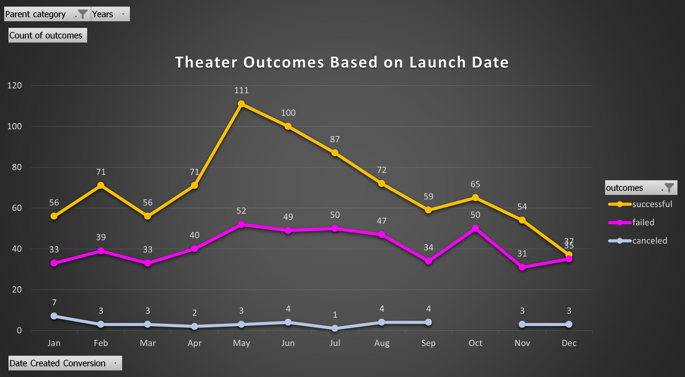

# Kickstarter Challenge 📢
Challenge Week1 Data Analysis BootCamp using Excel.
## ⚡Overview Of Project
Assist the playwright Louise to find out the behavior of the different campaigns in relation to the launch dates and the funding goals. The results will be graphed and analyzed for a better understanding.
## ⚡Analysis And Challenges
###  Analysis of Outcomes Based on Launch Date
To start, this analysis must be filtered with the Parent Category “Theater” and the “Launch Date” in months, then count the outcomes sorted by successful, failed or canceled. 

By looking at the graph, we can be sure that the best months to launch a successful campaign are May in the first place with a 67% success rate (111 successful/ 166 total) and June in second with a 65% rate (100 successful/ 153 total). 
It is important to also notice that December is the worst performer with a 47% failure rate (35 failed/ 75 total) and October with a 53% rate (50 failed/ 115 total). To succeed, the last months of the year should not be considered.

###  Analysis of Outcomes Based on Goals
For this analysis, we need to know how the outcomes behave in relation to the dollar amount criteria and, to get that data, a COUNTIFS formula was applied to pull the number of successful, failed, and canceled campaigns for 12 different amount ranges.	
By looking at the graph, we can be sure that the goal of less than $1,000 has highest success rate of 76% (141 successful/ 186 total) and in second place the goal from $1,000 to $4,999 with a success rate of 73% (388 successful/ 534 total). Please notice that the goal $1,000 to $4,999 has the 51% of all the campaigns but its not our first option, the goal of less than $1,000 has a lot of opportunity.

We can also see that the project is going to fail if the goal is $45,000 or more. Also, chances are high in the range between $25,000 and $34,999. These goals should not be considered. 

No Plays were canceled in this analysis and subcategory.

###  Challenges Encountered
It was a challenge to match the outcomes based on goals with the COUNTIFS function, I overcome this issue by taking my time looking closely for errors in the formula.

## ⚡Results
###  1. What are two conclusions you can draw about the Theater Outcomes by Launch Date?
The first conclusion would be to launch the campaign in May or June to have a high success rate. The second conclusion would be to avoid the last months of the year, especially October and December because the fail rate is the highest. 
###  2. What can you conclude about the Outcomes based on Goals?
The conclusion for the outcomes based on goals would be that the best ranges to choose are from less than $1,000 to $4,999 and avoid ranges with higher dollar amount because the chances to fail are bigger.
###  3. What are some limitations of this dataset?
The limitations are that we cannot analyze deeper, for example, it would be very useful to know if the campaigns had marketing strategies to make them successful or who the clients are, what’s their age? where exactly do they live? Also, it would be great to know which genre is more successful. This data could really make a difference and provide important insights to make better decisions. 
